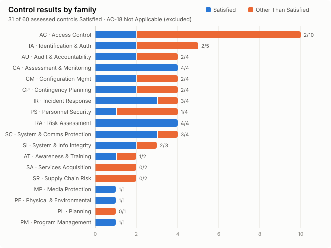
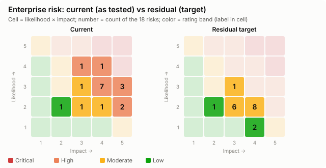
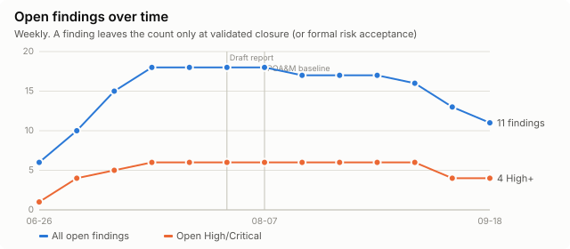
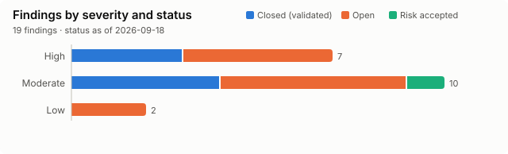

# Wrenfield Health: NIST SP 800-53 Security Control Assessment & GRC Program (Simulated)

[](.github/workflows/grc-ci.yml)


> **Portfolio project.** Wrenfield Health is a **fictional** healthcare-SaaS company; all data is **synthetic**. This is a **simulated** assessment built as an independent portfolio exercise. It is not an official audit, authorization, or certification, and the author did not work for this organization. See [DISCLAIMER.md](DISCLAIMER.md).

---

## ⏱ 30-second view

| | |
|---|---|
| **Objective** | Show end-to-end GRC work: scope a NIST SP 800-53 assessment, test controls, certify access, assess a critical vendor, score risk, remediate through a POA&M, and report to executives |
| **Organization** | *Wrenfield Health* (fictional): 347-person care-coordination and remote-patient-monitoring SaaS, a HIPAA business associate holding PHI for about 410,000 patients |
| **Scenario** | Pre-contract readiness: a **state Medicaid contract** requires NIST SP 800-53 Rev. 5 **Moderate** alignment, a Security Assessment Report, and a POA&M before go-live, and the largest customer's review flagged MFA and access-review gaps |
| **Framework** | **NIST SP 800-53 Rev. 5, Release 5.2.0** (verified current on NIST CSRC/OSCAL) · SP 800-53A · SP 800-53B · SP 800-37 · SP 800-30 · SP 800-161 · CSF 2.0 (reporting) |
| **Artifacts** | Control matrix · risk register · access review · evidence tracker · vendor assessment · POA&M · SAR · dashboard · 15 worksheets · policies · templates (**16 professional artifacts**, all cross-linked by ID) |
| **Major findings** | Terminated users with live access (incl. a post-termination sign-in) · MFA exemptions incl. an identity admin · excess production admins · unsupported software in the PHI path · internet-exposed RDP · an analytics vendor with **undisclosed offshore PHI access** |
| **Remediation lifecycle** | 19 findings → 19 POA&M items → **7 closed only after independent re-testing** · 1 formally risk-accepted · 2 overdue and 1 slipped (tracked, not hidden) |
| **Skills shown** | Control assessment · evidence judgment · IAM governance · third-party risk · risk analysis · POA&M management · executive communication · GRC automation |

<!-- GEN:keymetrics:START -->
| Measure | Result (status date 2026-09-18) |
|---|---|
| Controls assessed (SP 800-53 Rev. 5) | 60 assessed + 1 N/A, across 18 families |
| Satisfied / Other Than Satisfied | 31 / 29 (52% satisfied) |
| Owner-stated statuses corrected by testing | 27 of 61 |
| Findings (High / Moderate / Low) | 19 (7 / 10 / 2), 0 Critical |
| Findings closed with validation | 7 of 19 (median 66 days) |
| Open High findings | 4 (FIND-003, FIND-010, FIND-011, FIND-016) |
| POA&M overdue / slipped / risk-accepted | 2 / 1 / 1 |
| Access review | 106 entitlements, 20 exceptions (18 closed, 1 accepted, 1 open) |
| Vendor risk (Quarrystone) | 12 findings (1 Critical, contained) · decision: Mitigate (conditional continuation) + partial Transfer |
| Tier 1–2 vendors with current assessment | 9 of 14 |
| Evidence completion | 86% (67 of 78); 5 items insufficient, each became part of a finding |
| Enterprise risks rated High+ | 14 at fieldwork → 11 now → 0 at target (18 risks) |
<!-- GEN:keymetrics:END -->

<p>


</p>

---

## 🧭 5-minute view

**The lifecycle, and where each step lives:**

```
IDENTIFY REQUIREMENTS → IMPLEMENT CONTROLS → COLLECT EVIDENCE → TEST EFFECTIVENESS → IDENTIFY GAPS
  24 REQs (contract,     61 controls,         78 evidence        15 worksheets,       19 findings
  HIPAA)                 owner-stated         items, graded      5 scripted tests,    (5 Cs + exec
                         vs validated         by level           106-row access review  version)
→ ASSESS RISK → ASSIGN OWNERSHIP → REMEDIATE → TRACK PROGRESS → REPORT TO MANAGEMENT
  18 risks,     owners per          19 POA&M    formula-driven   SAR · Board briefing ·
  inherent →    control, risk,      items,      % complete,      dashboard (Excel formulas
  current →     and POA&M           milestones  overdue, slips   cross-checked vs Python)
  residual
```

| Topic | How it was done |
|---|---|
| **Assessment scope** | System WCP-PROD (AWS, Okta, GitHub, PHI database, legacy SFTP host, HR/finance SaaS, security tooling, vendor portal). Evidence period H1 2026; status date 2026-09-18. Out-of-scope items each justified. → [scope-statement.md](docs/scope/scope-statement.md) |
| **Control selection** | Moderate baseline (287), verified from NIST's OSCAL profile → filtered by contract/HIPAA drivers → weighted by threat → plus deliberately *expected-to-pass* controls to check for bias → **61**. One N/A (AC-18) and one inherited (PE-3), each with rationale. → [nist-800-53-strategy.md](docs/assessment/nist-800-53-strategy.md) |
| **Risk methodology** | Written **before** scoring: 5×5 likelihood × impact (adapted from SP 800-30), worst-credible impact across PHI, operations, financial, legal, and patient safety. Inherent → **current (failed controls earn no credit)** → residual. Appetite and acceptance authority by band. → [risk-methodology.md](risk/risk-methodology.md) |
| **Access review** | HR, Okta, 9 system exports, service register, role baseline, and SoD rules reconciled by a 13-check engine. Every flag dispositioned by a reviewer (no self-review): 29 flagged → **20 exceptions** + 1 false positive → rolled up to 7 findings. → [access-review/](access-review/README.md) |
| **Audit evidence** | PBC requests name artifact + population + period + format. Evidence is graded **design → implementation → operating effectiveness**. A screenshot and a design-only "closure" were rejected. → [evidence-quality-guide.md](audit/evidence-quality-guide.md) |
| **Vendor risk** | 16 vendors tiered by a scored model. Deep assessment of the PHI analytics vendor: 36 questions + **SOC 2 review incl. CUECs** + interviews → 12 findings (1 Critical, found by interview) → **conditional continuation** with conditions precedent. → [vendor-summary.md](vendor-risk/vendor-summary.md) |
| **POA&M workflow** | FIND-nnn ↔ POAM-nnn. SLA by severity, original vs revised target (slips need an approved reason), % complete from milestones, **closure only after validation**. Accepted risks stay listed until expiry. → [poam.md](poam/poam.md) · [lifecycle-traces.md](poam/lifecycle-traces.md) |

<p> </p>

---

## 🔬 Technical / GRC deep dive

### Deliverables

| # | Artifact | Location |
|---|---|---|
| 1 | Scope statement (+ project charter) | [docs/scope/scope-statement.md](docs/scope/scope-statement.md) · [project-charter.md](docs/scope/project-charter.md) |
| 2 | System / organization profile | [system-profile.md](docs/scope/system-profile.md) (FIPS 199, data-flow diagram) · [organization-profile.md](docs/scope/organization-profile.md) · [business-requirements.md](docs/scope/business-requirements.md) |
| 3 | **NIST SP 800-53 control matrix** | [controls/nist-800-53-control-matrix.xlsx](controls/nist-800-53-control-matrix.xlsx) · [CSV](controls/nist-800-53-control-matrix.csv) · [summary](controls/control-matrix.md) |
| 4 | Control-assessment worksheets | [docs/assessment/worksheets/](docs/assessment/worksheets/) · [assessment-procedures.xlsx](controls/assessment-procedures.xlsx) · [scripted test results](docs/assessment/test-results/) |
| 5 | Risk-scoring methodology | [risk/risk-methodology.md](risk/risk-methodology.md) |
| 6 | **Risk register** | [risk/risk-register.xlsx](risk/risk-register.xlsx) · [md](risk/risk-register.md) · [RACC-001 risk acceptance](risk/risk-acceptance/RACC-001.md) |
| 7 | **Access-control review** | [access-review/access-review.xlsx](access-review/access-review.xlsx) · [findings.md](access-review/findings.md) · [raw exports](access-review/source-exports/) |
| 8 | **Audit-evidence tracker** | [audit/evidence-tracker.xlsx](audit/evidence-tracker.xlsx) · [PBC list](audit/evidence-request-list.md) · [evidence samples](evidence/) |
| 9 | Vendor-risk questionnaire | [vendor-risk/vendor-questionnaire.xlsx](vendor-risk/vendor-questionnaire.xlsx) (template + responses) |
| 10 | **Vendor-risk assessment** | [vendor-risk/vendor-assessment.xlsx](vendor-risk/vendor-assessment.xlsx) · [md](vendor-risk/vendor-assessment.md) · [SOC 2 workpaper](evidence/SR/EVID-050_quarrystone-soc2-review-workpaper.md) |
| 11 | Vendor-risk executive summary | [vendor-risk/vendor-summary.md](vendor-risk/vendor-summary.md) |
| 12 | Findings register | [findings/findings-register.xlsx](findings/findings-register.xlsx) · [md (technical + executive versions)](findings/findings-register.md) |
| 13 | **POA&M** | [poam/poam.xlsx](poam/poam.xlsx) · [md](poam/poam.md) · [lifecycle traces](poam/lifecycle-traces.md) |
| 14 | Security Assessment Report | [docs/executive-reporting/security-assessment-report.md](docs/executive-reporting/security-assessment-report.md) · [Board briefing](docs/executive-reporting/executive-briefing.md) |
| 15 | Executive dashboard | [dashboard/dashboard.md](dashboard/dashboard.md) · [interactive HTML](dashboard/index.html) · [metric definitions](dashboard/metric-definitions.md) · [screenshot](screenshots/) · Excel **Dashboard** sheet in [workbook/wrenfield-grc-workbook.xlsx](workbook/wrenfield-grc-workbook.xlsx) |
| 16 | Lessons learned | [docs/lessons-learned.md](docs/lessons-learned.md) · [quality-review log](docs/quality-review.md) |

Also: [ID scheme](docs/id-scheme.md) · [traceability matrix](docs/assessment/traceability-matrix.md) · [integrity check (43 rules)](docs/assessment/integrity-check.md) · [catalog verification (61/61)](docs/assessment/catalog-verification.md) · [assessment plan](docs/assessment/assessment-plan.md) · [policies](docs/policies/) · [templates](templates/) · [phase-by-phase roadmap](docs/project-roadmap.md)

### Cross-artifact ID scheme (one governance system, not six spreadsheets)
`REQ-004` → **AC-2(3)** → `TP-AC-2(3)-02` on `EVID-003/004` → *Other Than Satisfied* → `AR-EX-01…04` → **`FIND-001`** → `RISK-002` → **`POAM-001`** → validated on `EVID-061/062` → closed 2026-09-10. Every reference resolves; [`tools/validate.py`](tools/validate.py) fails CI if one doesn't. → [id-scheme.md](docs/id-scheme.md)

### Reproduce everything
```bash
python -m venv .venv && .venv/Scripts/pip install -r requirements.txt   # (Linux/macOS: .venv/bin/pip)
python tools/run_all.py    # engine → tests → build xlsx/csv/md → metrics → verify 1,232 formulas → 43 integrity rules
pytest -q                  # 7 regression tests: reported numbers must match the evidence
```
`data/*.yaml` is the single source of truth; spreadsheets and tables are generated. Control titles: `python tools/verify_catalog.py <NIST OSCAL catalog.json>` found **61 of 61 exact matches** with NIST's official catalog v5.2.0 ([catalog-verification.md](docs/assessment/catalog-verification.md)).

---

## 🧑‍💼 Skill-to-evidence matrix (summary)
| Skill | Evidence |
|---|---|
| NIST 800-53 interpretation | [strategy](docs/assessment/nist-800-53-strategy.md) (version verified, 61 of 287 tailored, frameworks distinguished) |
| Control assessment | [15 worksheets](docs/assessment/worksheets/) · 54 Examine/Interview/Test steps |
| Evidence validation | [evidence-quality-guide.md](audit/evidence-quality-guide.md) · rejected EVID-009 and EVID-071 |
| Risk analysis | [risk register](risk/risk-register.md) with rationale for every score |
| IAM governance | [106-row certification](access-review/findings.md) + [reconciliation engine](tools/review_engine.py) |
| Third-party risk | [vendor summary](vendor-risk/vendor-summary.md) incl. CUEC analysis |
| POA&M & remediation | [POA&M](poam/poam.md) · [7 validated lifecycles](poam/lifecycle-traces.md) |
| Executive communication | [SAR](docs/executive-reporting/security-assessment-report.md) · [Board briefing](docs/executive-reporting/executive-briefing.md) |
| GRC automation | [tools/](tools/) · CI · formula verification |

Full matrix: [career/skill-to-evidence-matrix.md](career/skill-to-evidence-matrix.md) · Resume bullets: [career/resume-bullets.md](career/resume-bullets.md) · Interview prep: [career/interview-prep.md](career/interview-prep.md)

## ⭐ What this project shows that many GRC portfolios don't
1. **Evidence-quality judgment.** Evidence is graded by level; a screenshot and a design-only "closure" are *rejected* on the record, not quietly accepted.
2. **Design vs operating effectiveness.** 27 of 61 owner-stated statuses were corrected by testing. The policy said "24 hours"; the population test said 16 of 19.
3. **Real access governance.** A 13-check reconciliation across 9 systems finds leaver access in *non-SSO* stores, a shared vendor login, and a duplicate identity, with a false positive dispositioned rather than inflated.
4. **Control-to-risk-to-remediation traceability, machine-checked.** 43 integrity rules in CI; FIND ↔ POAM ↔ RISK ↔ control links validated in both directions.
5. **Remediation ownership and honesty.** Validated closures, a formally accepted risk, **overdue and slipped items shown, not hidden**, and an owner dispute with a documented resolution.
6. **Third-party risk beyond questionnaires.** SOC 2 carve-outs and CUECs analyzed; the Critical issue came from an interview; a decision with conditions precedent.
7. **Measurable governance without fake precision.** Every metric has a definition and a denominator; the Excel formulas are cross-checked against independent Python calculations.

## ✅ Final success test
> *"I scoped a simulated security assessment using NIST SP 800-53, mapped controls to implementation and evidence, evaluated access rights, assessed third-party risk, documented cybersecurity risks, identified control deficiencies, created remediation plans through a POA&M, tracked evidence and corrective actions, and translated technical findings into management-level risk reporting."*

| Clause | Supporting artifact |
|---|---|
| scoped a simulated assessment using NIST SP 800-53 | [scope-statement](docs/scope/scope-statement.md) · [strategy](docs/assessment/nist-800-53-strategy.md) |
| mapped controls to implementation and evidence | [control matrix](controls/nist-800-53-control-matrix.csv) · [traceability](docs/assessment/traceability-matrix.md) |
| evaluated access rights | [access review](access-review/findings.md) |
| assessed third-party risk | [vendor assessment](vendor-risk/vendor-assessment.md) · [summary](vendor-risk/vendor-summary.md) |
| documented cybersecurity risks | [risk register](risk/risk-register.md) |
| identified control deficiencies | [findings register](findings/findings-register.md) · [worksheets](docs/assessment/worksheets/) |
| created remediation plans through a POA&M | [POA&M](poam/poam.md) |
| tracked evidence and corrective actions | [evidence tracker](audit/evidence-tracker.csv) · [lifecycle traces](poam/lifecycle-traces.md) |
| translated findings into management reporting | [SAR](docs/executive-reporting/security-assessment-report.md) · [briefing](docs/executive-reporting/executive-briefing.md) · [dashboard](dashboard/dashboard.md) |

## Repository structure
```
├── README.md · DISCLAIMER.md · CHECKPOINT.md
├── data/                  single source of truth (YAML) → everything else is generated
├── docs/
│   ├── scope/             charter, scope, org + system profile, business requirements
│   ├── policies/          ACP-002, VM-003, TPRM-007, LMS-004/CMP-006 excerpts (design evidence)
│   ├── assessment/        NIST strategy, assessment plan, traceability, integrity check, worksheets/, test-results/
│   ├── executive-reporting/  SAR, Board briefing
│   └── project-roadmap.md · id-scheme.md · lessons-learned.md · quality-review.md
├── controls/              control matrix + assessment procedures
├── risk/                  methodology, register, risk-acceptance/
├── access-review/         certification, findings, source-exports/
├── audit/                 evidence tracker, PBC list, evidence quality guide
├── vendor-risk/           questionnaire, assessment, executive summary
├── findings/              findings register (technical + executive)
├── poam/                  POA&M, milestones, lifecycle traces
├── evidence/              synthetic evidence samples by family (AC AU CM CP IA IR RA SR)
├── dashboard/             metrics.json, dashboard.md, index.html, SVG charts, metric definitions
├── workbook/              combined workbook with live-formula Dashboard
├── templates/             blank templates (xlsx/csv/md)
├── career/                skill matrix, resume bullets, interview prep
├── screenshots/
├── tools/                 build, review engine, assessment tests, metrics, validate, check_formulas
└── tests/                 pytest regression suite
```

---
*Companion project: [kestrel-security-program](https://github.com/InnovaeonLabs/kestrel-security-program), a detection engineering and security operations portfolio for a fictional fintech.*
*Author: Markese Raley · independent portfolio project · all organizations, people, and data are fictional.*
