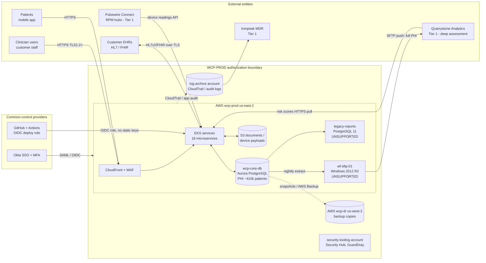

# System Profile: WCP-PROD

| Field | Value |
|---|---|
| Document ID | GOV-SYS-001 · v1.0 · 2026-06-19 |
| Relationship to the SSP | Summarizes the system for assessment purposes. The authoritative System Security Plan (SSP v1.3, Feb 2025) is **outdated** (see FIND-017). This profile reflects the as-found environment |

## 1. System description

WCP-PROD is the production environment of the Wrenfield Care Platform. It runs in AWS `us-east-2` on Amazon EKS, with an Aurora PostgreSQL cluster (`wcp-core-db`) as the primary PHI store. Backups are copied to `us-west-2` (`wcp-dr`). Workforce users reach administrative interfaces only through Okta SSO. Clinicians use the web app; patients use the mobile app.

## 2. Boundary and data-flow diagram

**What the diagram shows the assessor:**
1. The **nightly full-PHI extract** leaves the boundary through an **unsupported host** (`wf-sftp-01`). That single path ties together SA-22, SC-7, SA-9, SR-6, and RISK-007/RISK-010.
2. **Okta** is a common-control provider. An Okta weakness (MFA exemptions) affects every system.
3. **GitHub Actions** deploys through federated OIDC roles. This is a positive design choice (no long-lived deploy keys) and was verified under IA-5.

## 3. Users and roles

| User type | Approx. count | Access path | Notes |
|---|---|---|---|
| Customer clinicians and staff | about 6,800 | WCP web app (customer-federated SSO or WCP local auth + MFA) | Customer-managed; out of scope for the workforce access review |
| Patients | about 410,000 enrolled (about 190,000 active app users) | Mobile app | Out of scope |
| Wrenfield workforce | 347 | Okta SSO to AWS, GitHub, DB tools, SaaS | In scope |
| Privileged access | 37 privileged entitlements across 9 systems (see access review) | Okta, then admin roles | In scope: 100% reviewed |
| Service, shared, and break-glass accounts | 13 registered (all reviewed) | API keys, SSH keys, OIDC roles, vaulted passwords | In scope |
| Vendor personnel | Ironpeak MDR analysts, Quarrystone support | Vendor-side access | In scope via the access review and vendor assessment |

## 4. Security categorization (FIPS 199)

Information types were selected with reference to NIST SP 800-60 Vol. 2 Rev. 1 (health information types) and adjusted for Wrenfield's use.

| Information type | C | I | A | Rationale |
|---|---|---|---|---|
| Health care delivery / care-coordination records (PHI) | **Moderate** | **Moderate** | **Moderate** | Unauthorized disclosure causes *serious* adverse effect: HIPAA breach, harm to individuals, contract loss. Integrity errors could mis-prioritize outreach, but clinicians confirm before acting (WCP is not an emergency-alerting or life-sustaining device). Outages are serious but survivable with documented downtime procedures |
| RPM device readings | Moderate | Moderate | Low | Readings are advisory; customers' clinical protocols cover missed readings |
| Population-health risk scores | Low | Moderate | Low | Wrong scores could mis-rank outreach; a rules-based fallback exists |
| System and security logs | Moderate | Moderate | Low | Needed for breach scoping and investigation (HIPAA and CSA) |
| Workforce identity data | Moderate | Moderate | Moderate | Compromise enables system-wide access |

**Overall categorization:** high-water mark = **Moderate** {C: M, I: M, A: M}.

**Challenged during the assessment:** *"Should integrity be High because RPM data could affect patient safety?"* Decision: **No**. WCP's RPM alerts are advisory and time-delayed by design, and customer contracts state that WCP is not intended for emergency monitoring. If Wrenfield ever adds real-time alerting that clinicians act on without verification, the categorization must be revisited (logged as an RA-2 review trigger).

## 5. Interconnections

| Interconnection | Direction | Data | Agreement | Assessed under |
|---|---|---|---|---|
| Customer EHRs (38) | Bi-directional | PHI (ADT, FHIR resources) | BAA + interface spec per customer | CA-3 (sampled 3) |
| Quarrystone Analytics | Outbound extract (SFTP), inbound scores (HTTPS) | Full PHI, about 410k patients | MSA + BAA (2023) + Data Sharing Specification v2 | CA-3, SA-9, SR-6, vendor assessment |
| Pulsewire Connect | Inbound device data | PHI (readings) | MSA + BAA | SA-9 (program level) |
| Clearpath Messaging | Outbound SMS | Minimal PHI (first name, appointment time) | MSA + BAA | SA-9 (program level) |
| Ironpeak MDR | Read access to SIEM/EDR | Security telemetry, may include PHI fragments | MSA + BAA | SA-9, access review (shared account) |

## 6. Control inheritance

| Provider | Controls inherited or shared | Customer (Wrenfield) responsibility retained |
|---|---|---|
| AWS | PE family (physical data-center security), MP-6 for AWS-managed storage media, hypervisor-level SC controls | IAM, network configuration, encryption settings, logging configuration, backups |
| Okta | Platform availability, authenticator cryptography | Policy configuration (MFA rules, exemptions), admin role assignment, lifecycle |
| GitHub | Platform security | Org owners, branch protection, Actions permissions, secret management |

The shared-responsibility boundary is why most findings sit in Wrenfield's configuration and process, not in the platforms.
